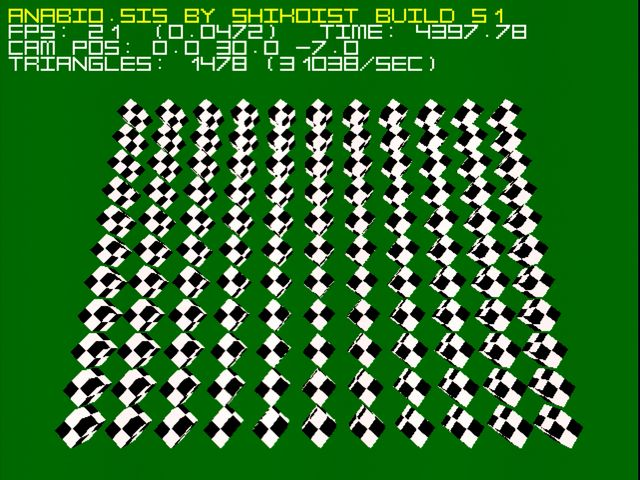

# ANABIO.SIS — 3D Engine for 3dfx Voodoo and Sound Blaster Pro 2 under DOS

A game 3D engine for the **3dfx Voodoo 1** graphics accelerator running under **MS-DOS**. It uses the original **3dfx Glide SDK** for hardware-accelerated textured triangle rendering, W-buffer, and anti-aliasing. Supports **Sound Blaster Pro 2 or compatible** sound cards. Expected CPU is something in the range of an **Intel Pentium 150–233 MHz**. The engine is still under active development. Development is primarily done in Russian (I speak Russian better than English), but I plan to gradually translate the comments into English.



## Table of Contents

- [Features](#features)
- [Technical Stack](#technical-stack)
- [Architecture](#architecture)
- [Controls](#controls)
- [Building](#building)
- [Loading Textures](#loading-textures)
- [Loading Models](#loading-models)
- [Contacts](#contacts)
- [License](#license)

## Features

- **Hardware 3D rendering** via 3dfx Glide SDK 2.43
- **W-buffer** (hardware depth buffer of the Voodoo, instead of Z-buffer)
- **Anti-aliasing** of triangles and lines (AA)
- **Texture loading** from `.3df` files — the native 3dfx format (using the texus.exe utility)
- **Model loading** from `.obj` files with normals and UV coordinates
- **Frustum culling** — discarding triangles outside the camera view
- **Quaternion-based camera** — rotation without gimbal lock
- **Sprite font** for drawing text over the 3D scene
- **Fast math** — lookup tables (LUT) for sin/cos
- **Support for up to 3 TMUs** (theoretically) (Voodoo texture mapping units)
- **Texture memory overflow testing** for the TMUs

---

## Technical Stack

| Component          | Value                              |
|--------------------|------------------------------------|
| **Language**       | C (32-bit, protected mode)         |
| **Compiler**       | Open Watcom C/C++ 2.0 beta         |
| **SDK**            | 3dfx Glide 2.43 (SST-1 / Voodoo1)  |
| **DOS Extender**   | DOS4GW                             |
| **Texture format** | .3df (Glide 3DFX)                  |
| **Model format**   | Wavefront .OBJ                     |
| **OS**             | MS-DOS 6.22+                       |
| **Runs on**        | DOSBox-X, 86Box, real hardware     |

## Architecture

The project consists of modular components:

| Module            | Purpose                                                      |
|-------------------|--------------------------------------------------------------|
| `main.c`          | Main loop, Glide initialization, input handling              |
| `camera.c/.h`     | Camera, quaternions, View matrix, frustum handling           |
| `mesh.c/.h`       | Model loading (.obj), frustum clipping, mesh rendering       |
| `matrix.c/.h`     | 4×4 matrix operations (Model, View, Projection)              |
| `primitiv.c/.h`   | Basic primitives (test cube)                                 |
| `texture.c/.h`    | Loading .3df textures into TMU memory                        |
| `text.c/.h`       | Sprite font, text/FPS output                                 |
| `fastmath.c/.h`   | sin/cos LUTs, quaternions                                    |
| `keyboard.c/.h`   | Keyboard polling via interrupts                              |
| `sound.c/.h`      | Playing sounds                                               |
| `timer.c/.h`      | PIT timer with increased frequency (64×)                     |
| `file.c/.h`       | File utility functions                                       |
| `object.c/.h`     | Game object system (placeholder)                             |

### Rendering Pipeline

[One frame]
→ grBufferClear()          clear the current buffer
→ UpdateView()             update the camera matrix
→ DrawMesh()               draw meshes
→ ApplyMatrix()            apply Model-View-Projection matrix to all mesh vertices
→ DropTriangleByFrustum()  discard triangles outside the view frustum
→ grDrawTriangle()         hardware triangle rendering on 3dfx Voodoo
→ DrawText()               draw text overlay
→ grBufferSwap()           swap buffers


## Controls

| Key                     | Action                                          |
|-------------------------|-------------------------------------------------|
| **W/A/S/D/Q/E**         | Move camera (forward/left/back/right/up/down)   |
| **Home / End**          | Rotate camera (X / pitch)                       |
| **Insert / PageUp**     | Rotate around axis (Z / roll)                   |
| **Delete / PageDown**   | Rotate around axis (Y / yaw)                    |
| **F6**                  | Toggle wireframe mode                           |
| **ESC**                 | Exit                                            |

## Building

### Requirements

1. **Open Watcom 2.0 beta** — [GitHub releases](https://github.com/open-watcom/open-watcom-v2/releases)
2. **Glide SDK 2.43** — header files and libraries for 3dfx Voodoo 1
3. **MS-DOS 6.22+** or **DOSBox-X**

### Download Links
- [DOSBox-X](https://github.com/joncampbell123/dosbox-x/releases/download/dosbox-x-v2026.03.29/dosbox-x-windows-2026.01.02-setup.exe)
- [Open Watcom 2.0 beta](https://github.com/open-watcom/open-watcom-v2/releases/download/Current-build/open-watcom-2_0-c-dos.exe)
- [Glide SDK 2.43 (original)](https://theretroweb.com/uploads/drivers/glide-sdk-243-680a30153ff2c958751668.zip)
- [Glide SDK 2.43 (repack)](https://disk.yandex.ru/d/xc6e1awOcznfuA)

### Environment Setup

Install DOSBox-X.

Recommended settings for 3dfx Voodoo 1 in `dosbox-x.conf`:

```
[voodoo]
voodoo_card   = software
voodoo_maxmem = false
glide         = false
lfb           = full_noaux
splash        = false
```

Choose a folder on your PC that will serve as the root directory for DOSBox-X.

For example (replace [user_name] with your own):

```C:\Users\[user_name]\DOS```

Also in `dosbox-x.conf`:

```[autoexec]
MOUNT c C:\Users\[user_name]\DOS
C:
cd C:\PROJECTS\ANABIO.SIS
REM COMPILE.BAT
REM MAIN.EXE```

The [cpu] section of dosbox-x.conf also needs editing:

```[cpu]
cycles = max```

Create the following folder structure:
C:\Users\[user_name]\DOS\PROJECTS
C:\Users\[user_name]\DOS\PROJECTS\ANABIO.SIS
Copy the project’s *.c / *.h / *.txt / COMPILE.BAT files into
C:\Users\[user_name]\DOS\PROJECTS\ANABIO.SIS.

Now work inside DOSBox-X.

For convenience you can install Norton Commander or Volkov Commander - simply place the programs into C:\NC or C:\VC and use them from there.
Install Open Watcom 2.0 beta for DOS (default location is C:\WATCOM).

Unpack the Glide SDK 2.43 into a folder named GLIDE243, preserving the original directory structure.
The resulting directory tree should look like this:
```
C:\Users\[user_name]\DOS\          (real location on the host)

C:\                                (inside DOSBox-X)
GLIDE243
│   ├── Src\Sst1\include\          *.h files
│   └── Lib\Dos\Stack              *.lib files
├── PROJECTS\
│   └── ANABIO.SIS\                *.c / *.h / *.* files of this project
│       ├── TEXTURES\              *.3df textures
│       ├── MODELS\                *.obj models
│       └── COMPILE.BAT            build batch file
└── WATCOM\
    └── H\                         *.h files
```

## Compilation
Open a DOS command prompt and run:
COMPILE.BAT

Result: MAIN.EXE

## Loading Textures

### 3df Format
The native 3dfx format is supported.
The Glide SDK 2.43 includes the utility TEXUS.EXE (located in \GLIDE243\Bin\Dos).
It accepts only TGA files as input.
I wrote a simple batch file (\TEXTURES\TO3DF.BAT) that converts TGA to 3DF without compression.
It is executed inside DOSBox-X:

C:\GLIDE243\BIN\DOS\TEXUS.EXE -rn -mn -dn -t rgb565 -o .3df %1

When I need to create a new texture, I save it as a TGA file in the \TEXTURES folder, then run TEXUS1.BAT SAMPLE.TGA in that folder.

A SAMPLE.3DF file will appear, which can then be loaded by the engine.

## Loading Models

### Wavefront OBJ Format
Basic .obj format is supported:
Vertex              v  1.0 0.0 0.0
Texture coordinate  vt 0.0 1.0
Normal              vn 0.0 0.0 1.0
Face (with UVs and normals)  f 1/1/1 2/2/2 3/3/3

### Limitations
Only triangles are supported (f v/vt/vn v/vt/vn v/vt/vn)
Quads and n-gons are not supported
Materials (.mtl) are not loaded
Maximum: 512 vertices, 512 triangles

## Contacts

Discord:
https://discord.com/channels/562256527029960714/1549091150516850729

## License
https://creativecommons.org/publicdomain/zero/1.0/deed.en